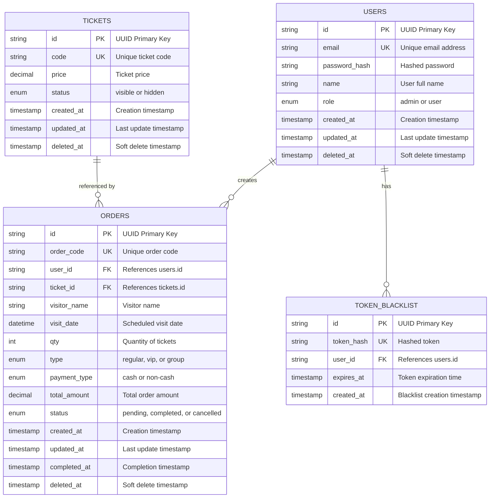

# Ticketing Mock API - Entity Relationship Diagram (ERD)

## Mermaid ERD Diagram



## Database Schema Details

### USERS Table
Master table for user accounts with authentication and role management.

| Column | Type | Constraints | Description |
|--------|------|-------------|-------------|
| id | VARCHAR(36) | PRIMARY KEY | UUID identifier |
| email | VARCHAR(255) | UNIQUE, NOT NULL | User email address |
| password_hash | VARCHAR(255) | NOT NULL | Bcrypt hashed password |
| name | VARCHAR(255) | NOT NULL | User full name |
| role | ENUM('admin', 'user') | DEFAULT 'user' | User role for authorization |
| created_at | TIMESTAMP | DEFAULT CURRENT_TIMESTAMP | Record creation time |
| updated_at | TIMESTAMP | DEFAULT CURRENT_TIMESTAMP ON UPDATE | Last modification time |
| deleted_at | TIMESTAMP | NULL | Soft delete timestamp |

**Indexes:**
- `idx_email` on email (for login queries)
- `idx_role` on role (for role-based filtering)

**Relationships:**
- One-to-Many with ORDERS (user creates multiple orders)
- One-to-Many with TOKEN_BLACKLIST (user has multiple blacklisted tokens)

---

### TICKETS Table
Master data table for available ticket types with pricing and visibility control.

| Column | Type | Constraints | Description |
|--------|------|-------------|-------------|
| id | VARCHAR(36) | PRIMARY KEY | UUID identifier |
| code | VARCHAR(50) | UNIQUE, NOT NULL | Ticket code (e.g., TCK-00001) |
| price | DECIMAL(12, 2) | NOT NULL | Ticket price in currency units |
| status | ENUM('visible', 'hidden') | DEFAULT 'visible' | Visibility status in catalog |
| created_at | TIMESTAMP | DEFAULT CURRENT_TIMESTAMP | Record creation time |
| updated_at | TIMESTAMP | DEFAULT CURRENT_TIMESTAMP ON UPDATE | Last modification time |
| deleted_at | TIMESTAMP | NULL | Soft delete timestamp |

**Indexes:**
- `idx_code` on code (for ticket lookup)
- `idx_status` on status (for filtering visible tickets)

**Relationships:**
- One-to-Many with ORDERS (ticket can be ordered multiple times)

---

### ORDERS Table
Transaction table for ticket purchases with visitor and payment information.

| Column | Type | Constraints | Description |
|--------|------|-------------|-------------|
| id | VARCHAR(36) | PRIMARY KEY | UUID identifier |
| order_code | VARCHAR(50) | UNIQUE, NOT NULL | Order code (e.g., ORD-1234567890-ABC123) |
| user_id | VARCHAR(36) | FOREIGN KEY, NOT NULL | References users.id (ON DELETE CASCADE) |
| ticket_id | VARCHAR(36) | FOREIGN KEY, NOT NULL | References tickets.id |
| visitor_name | VARCHAR(255) | NOT NULL | Name of ticket visitor |
| visit_date | DATETIME | NOT NULL | Scheduled visit date and time |
| qty | INT | NOT NULL | Number of tickets ordered |
| type | ENUM('regular', 'vip', 'group') | DEFAULT 'regular' | Ticket type classification |
| payment_type | ENUM('cash', 'non-cash') | DEFAULT 'cash' | Payment method |
| total_amount | DECIMAL(12, 2) | NOT NULL | Total order amount |
| status | ENUM('pending', 'completed', 'cancelled') | DEFAULT 'pending' | Order status |
| created_at | TIMESTAMP | DEFAULT CURRENT_TIMESTAMP | Order creation time |
| updated_at | TIMESTAMP | DEFAULT CURRENT_TIMESTAMP ON UPDATE | Last modification time |
| completed_at | TIMESTAMP | NULL | Order completion time |
| deleted_at | TIMESTAMP | NULL | Soft delete timestamp |

**Indexes:**
- `idx_user_id` on user_id (for user order queries)
- `idx_ticket_id` on ticket_id (for ticket order queries)
- `idx_status` on status (for status filtering)
- `idx_order_code` on order_code (for order lookup)

**Relationships:**
- Many-to-One with USERS (order belongs to a user)
- Many-to-One with TICKETS (order references a ticket)

---

### TOKEN_BLACKLIST Table
Security table for managing JWT token revocation on logout.

| Column | Type | Constraints | Description |
|--------|------|-------------|-------------|
| id | VARCHAR(36) | PRIMARY KEY | UUID identifier |
| token_hash | VARCHAR(255) | UNIQUE, NOT NULL | SHA256 hash of the token |
| user_id | VARCHAR(36) | FOREIGN KEY, NOT NULL | References users.id (ON DELETE CASCADE) |
| expires_at | TIMESTAMP | NOT NULL | Token expiration time |
| created_at | TIMESTAMP | DEFAULT CURRENT_TIMESTAMP | Blacklist entry creation time |

**Indexes:**
- `idx_expires_at` on expires_at (for cleanup queries)

**Relationships:**
- Many-to-One with USERS (multiple tokens per user)

---

## Relationships Summary

### One-to-Many Relationships

1. **USERS → ORDERS**
   - One user can create multiple orders
   - Foreign Key: `orders.user_id` → `users.id`
   - Cascade Delete: When user is deleted, their orders are deleted

2. **USERS → TOKEN_BLACKLIST**
   - One user can have multiple blacklisted tokens
   - Foreign Key: `token_blacklist.user_id` → `users.id`
   - Cascade Delete: When user is deleted, their blacklisted tokens are deleted

3. **TICKETS → ORDERS**
   - One ticket type can be ordered multiple times
   - Foreign Key: `orders.ticket_id` → `tickets.id`
   - No cascade delete: Ticket deletion doesn't affect orders

---

## Data Integrity Rules

### Primary Keys
- All tables use UUID (VARCHAR(36)) as primary key
- Ensures distributed system compatibility

### Unique Constraints
- `users.email` - Prevents duplicate user accounts
- `tickets.code` - Ensures unique ticket codes
- `orders.order_code` - Ensures unique order identifiers
- `token_blacklist.token_hash` - Prevents duplicate blacklist entries

### Foreign Keys
- `orders.user_id` → `users.id` (ON DELETE CASCADE)
- `orders.ticket_id` → `tickets.id`
- `token_blacklist.user_id` → `users.id` (ON DELETE CASCADE)

### Soft Deletes
- `users.deleted_at` - Soft delete for user records
- `tickets.deleted_at` - Soft delete for ticket records
- `orders.deleted_at` - Soft delete for order records
- Allows data recovery and maintains referential integrity

---

## Enum Values

### USERS.role
- `admin` - Administrator with full access
- `user` - Regular user with limited access

### TICKETS.status
- `visible` - Ticket is visible in catalog
- `hidden` - Ticket is hidden from catalog

### ORDERS.type
- `regular` - Regular ticket type
- `vip` - VIP ticket type
- `group` - Group ticket type

### ORDERS.payment_type
- `cash` - Cash payment
- `non-cash` - Non-cash payment (card, transfer, etc.)

### ORDERS.status
- `pending` - Order awaiting completion
- `completed` - Order successfully completed
- `cancelled` - Order has been cancelled

---

## Indexing Strategy

### Performance Indexes
- `users.idx_email` - Fast login queries
- `users.idx_role` - Fast role-based filtering
- `tickets.idx_code` - Fast ticket lookup
- `tickets.idx_status` - Fast visible ticket filtering
- `orders.idx_user_id` - Fast user order queries
- `orders.idx_ticket_id` - Fast ticket order queries
- `orders.idx_status` - Fast status filtering
- `orders.idx_order_code` - Fast order lookup
- `token_blacklist.idx_expires_at` - Fast token cleanup queries

---

## Data Flow

```
User Registration/Login
    ↓
USERS table (store credentials)
    ↓
JWT Token Generation
    ↓
Token Blacklist on Logout
    ↓
TOKEN_BLACKLIST table

User Browses Tickets
    ↓
TICKETS table (visible tickets)
    ↓
User Creates Order
    ↓
ORDERS table (store order details)
    ↓
Order Status Updates
    ↓
ORDERS table (update status)
```

---

## Sample Data Relationships

### Example: User Creates Order

```
User: admin@example.com (id: user-1)
  ↓
Order: ORD-00001 (id: order-1)
  ├─ user_id: user-1 (references USERS)
  ├─ ticket_id: ticket-1 (references TICKETS)
  ├─ visitor_name: John Doe
  ├─ qty: 2
  ├─ total_amount: 150000
  └─ status: completed
```

### Example: Token Blacklist on Logout

```
User: john@example.com (id: user-2)
  ↓
Logout Action
  ↓
TOKEN_BLACKLIST entry
  ├─ token_hash: sha256(jwt_token)
  ├─ user_id: user-2 (references USERS)
  └─ expires_at: 2026-02-13T12:00:00Z
```

---

## Query Examples

### Get User Orders
```sql
SELECT o.* FROM orders o
WHERE o.user_id = 'user-1'
AND o.deleted_at IS NULL
ORDER BY o.created_at DESC;
```

### Get Visible Tickets
```sql
SELECT t.* FROM tickets t
WHERE t.status = 'visible'
AND t.deleted_at IS NULL
ORDER BY t.code;
```

### Get Order with User and Ticket Details
```sql
SELECT o.*, u.name, u.email, t.code, t.price
FROM orders o
JOIN users u ON o.user_id = u.id
JOIN tickets t ON o.ticket_id = t.id
WHERE o.id = 'order-1'
AND o.deleted_at IS NULL;
```

### Check if Token is Blacklisted
```sql
SELECT * FROM token_blacklist
WHERE token_hash = 'hash_value'
AND expires_at > NOW();
```

### Get Revenue by Payment Type
```sql
SELECT o.payment_type, SUM(o.total_amount) as total_revenue
FROM orders o
WHERE o.status = 'completed'
AND o.deleted_at IS NULL
GROUP BY o.payment_type;
```

---

## Database Normalization

The schema follows **Third Normal Form (3NF)**:

1. **1NF** - All attributes contain atomic values
2. **2NF** - All non-key attributes depend on the entire primary key
3. **3NF** - No transitive dependencies between non-key attributes

### Normalization Benefits
- Eliminates data redundancy
- Ensures data consistency
- Improves query performance
- Simplifies maintenance and updates
