# Ticketing Mock API - Sequence Diagrams

## 1. User Login Sequence

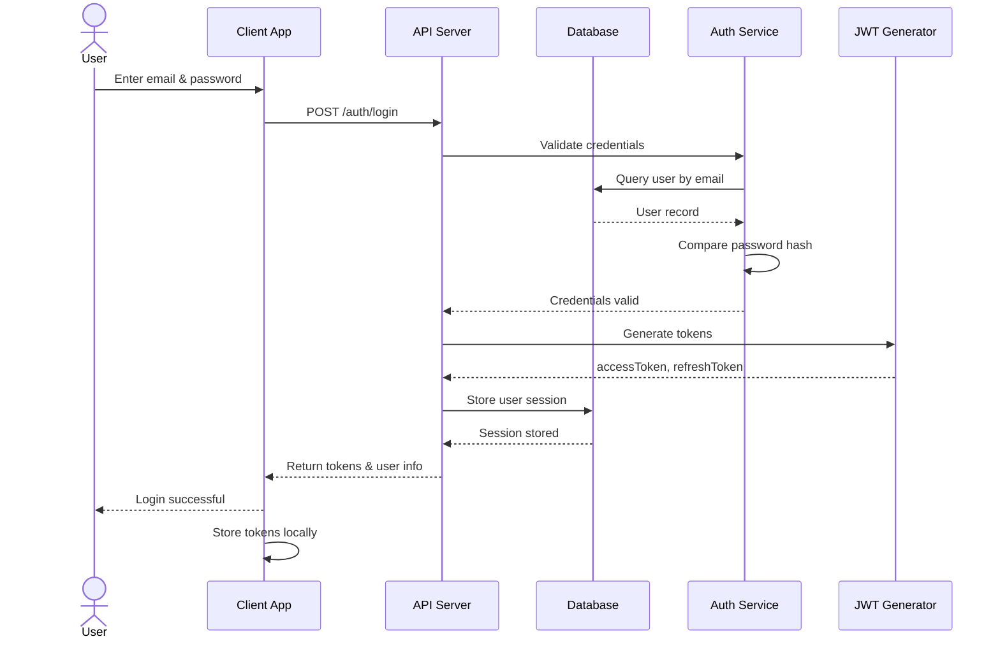
```mermaid
sequenceDiagram
    actor User
    participant Client as Client App
    participant API as API Server
    participant DB as Database
    participant Auth as Auth Service
    participant JWT as JWT Generator

    User->>Client: Enter email & password
    Client->>API: POST /auth/login
    API->>Auth: Validate credentials
    Auth->>DB: Query user by email
    DB-->>Auth: User record
    Auth->>Auth: Compare password hash
    Auth-->>API: Credentials valid
    API->>JWT: Generate tokens
    JWT-->>API: accessToken, refreshToken
    API->>DB: Store user session
    DB-->>API: Session stored
    API-->>Client: Return tokens & user info
    Client-->>User: Login successful
    Client->>Client: Store tokens locally
```

---

## 2. User Logout Sequence

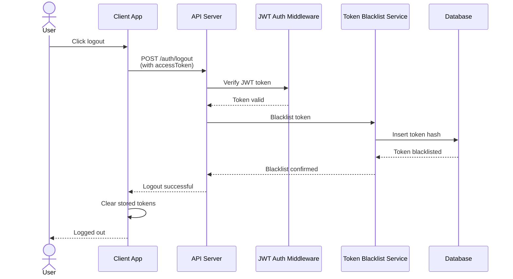
```mermaid
sequenceDiagram
    actor User
    participant Client as Client App
    participant API as API Server
    participant Auth as JWT Auth Middleware
    participant Blacklist as Token Blacklist Service
    participant DB as Database

    User->>Client: Click logout
    Client->>API: POST /auth/logout<br/>(with accessToken)
    API->>Auth: Verify JWT token
    Auth-->>API: Token valid
    API->>Blacklist: Blacklist token
    Blacklist->>DB: Insert token hash
    DB-->>Blacklist: Token blacklisted
    Blacklist-->>API: Blacklist confirmed
    API-->>Client: Logout successful
    Client->>Client: Clear stored tokens
    Client-->>User: Logged out
```

---

## 3. User Registration & Token Refresh Sequence

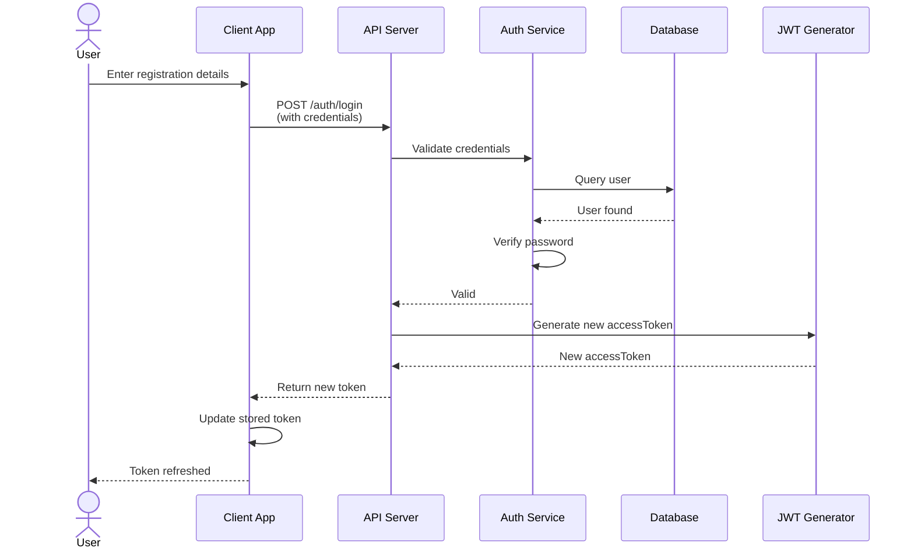
```mermaid
sequenceDiagram
    actor User
    participant Client as Client App
    participant API as API Server
    participant Auth as Auth Service
    participant DB as Database
    participant JWT as JWT Generator

    User->>Client: Enter registration details
    Client->>API: POST /auth/login<br/>(with credentials)
    API->>Auth: Validate credentials
    Auth->>DB: Query user
    DB-->>Auth: User found
    Auth->>Auth: Verify password
    Auth-->>API: Valid
    API->>JWT: Generate new accessToken
    JWT-->>API: New accessToken
    API-->>Client: Return new token
    Client->>Client: Update stored token
    Client-->>User: Token refreshed
```

---

## 4. Browse Tickets Sequence

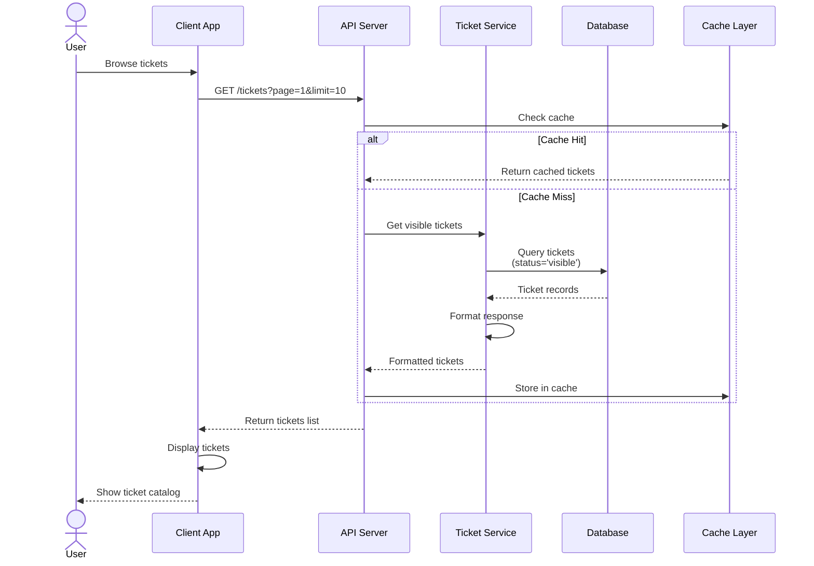
```mermaid
sequenceDiagram
    actor User
    participant Client as Client App
    participant API as API Server
    participant Ticket as Ticket Service
    participant DB as Database
    participant Cache as Cache Layer

    User->>Client: Browse tickets
    Client->>API: GET /tickets?page=1&limit=10
    API->>Cache: Check cache
    alt Cache Hit
        Cache-->>API: Return cached tickets
    else Cache Miss
        API->>Ticket: Get visible tickets
        Ticket->>DB: Query tickets<br/>(status='visible')
        DB-->>Ticket: Ticket records
        Ticket->>Ticket: Format response
        Ticket-->>API: Formatted tickets
        API->>Cache: Store in cache
    end
    API-->>Client: Return tickets list
    Client->>Client: Display tickets
    Client-->>User: Show ticket catalog
```

---

## 5. Create Order Sequence

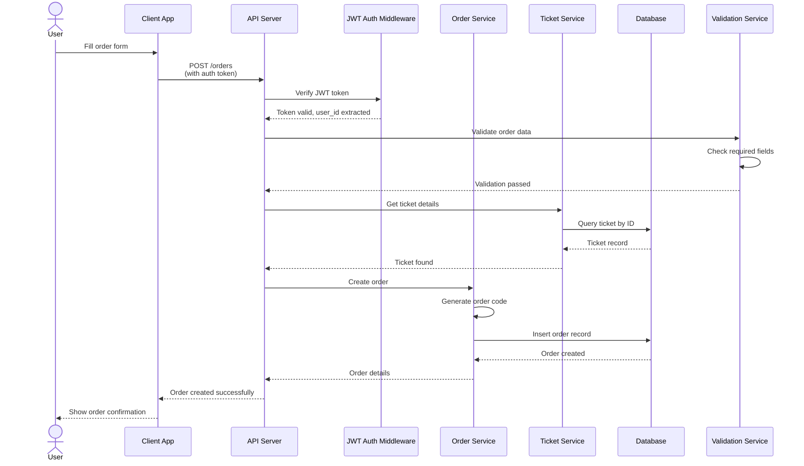
```mermaid
sequenceDiagram
    actor User
    participant Client as Client App
    participant API as API Server
    participant Auth as JWT Auth Middleware
    participant Order as Order Service
    participant Ticket as Ticket Service
    participant DB as Database
    participant Validation as Validation Service

    User->>Client: Fill order form
    Client->>API: POST /orders<br/>(with auth token)
    API->>Auth: Verify JWT token
    Auth-->>API: Token valid, user_id extracted
    API->>Validation: Validate order data
    Validation->>Validation: Check required fields
    Validation-->>API: Validation passed
    API->>Ticket: Get ticket details
    Ticket->>DB: Query ticket by ID
    DB-->>Ticket: Ticket record
    Ticket-->>API: Ticket found
    API->>Order: Create order
    Order->>Order: Generate order code
    Order->>DB: Insert order record
    DB-->>Order: Order created
    Order-->>API: Order details
    API-->>Client: Order created successfully
    Client-->>User: Show order confirmation
```

---

## 6. Update Order Status Sequence

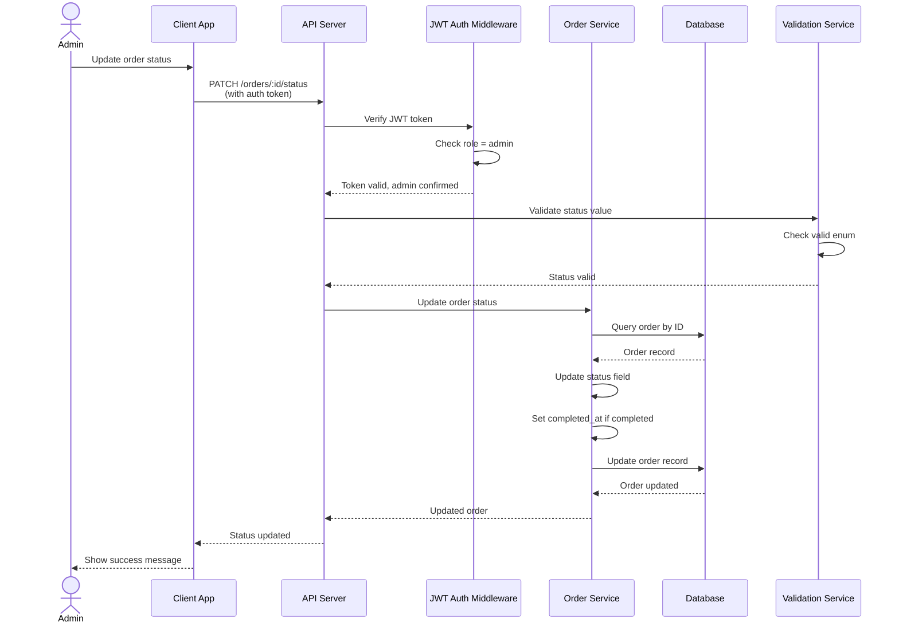
```mermaid
sequenceDiagram
    actor Admin
    participant Client as Client App
    participant API as API Server
    participant Auth as JWT Auth Middleware
    participant Order as Order Service
    participant DB as Database
    participant Validation as Validation Service

    Admin->>Client: Update order status
    Client->>API: PATCH /orders/:id/status<br/>(with auth token)
    API->>Auth: Verify JWT token
    Auth->>Auth: Check role = admin
    Auth-->>API: Token valid, admin confirmed
    API->>Validation: Validate status value
    Validation->>Validation: Check valid enum
    Validation-->>API: Status valid
    API->>Order: Update order status
    Order->>DB: Query order by ID
    DB-->>Order: Order record
    Order->>Order: Update status field
    Order->>Order: Set completed_at if completed
    Order->>DB: Update order record
    DB-->>Order: Order updated
    Order-->>API: Updated order
    API-->>Client: Status updated
    Client-->>Admin: Show success message
```

---

## 7. View Analytics Dashboard Sequence

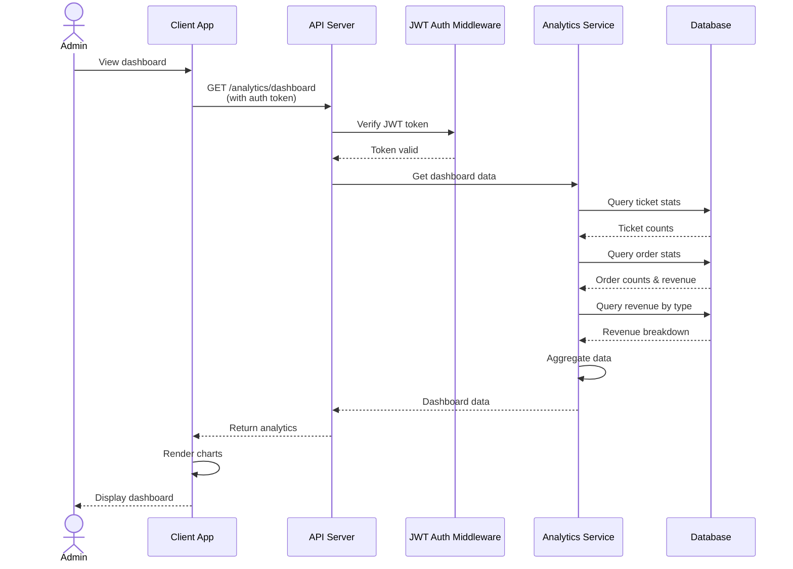
```mermaid
sequenceDiagram
    actor Admin
    participant Client as Client App
    participant API as API Server
    participant Auth as JWT Auth Middleware
    participant Analytics as Analytics Service
    participant DB as Database

    Admin->>Client: View dashboard
    Client->>API: GET /analytics/dashboard<br/>(with auth token)
    API->>Auth: Verify JWT token
    Auth-->>API: Token valid
    API->>Analytics: Get dashboard data
    Analytics->>DB: Query ticket stats
    DB-->>Analytics: Ticket counts
    Analytics->>DB: Query order stats
    DB-->>Analytics: Order counts & revenue
    Analytics->>DB: Query revenue by type
    DB-->>Analytics: Revenue breakdown
    Analytics->>Analytics: Aggregate data
    Analytics-->>API: Dashboard data
    API-->>Client: Return analytics
    Client->>Client: Render charts
    Client-->>Admin: Display dashboard
```

---

## 8. Generate Sales Report Sequence

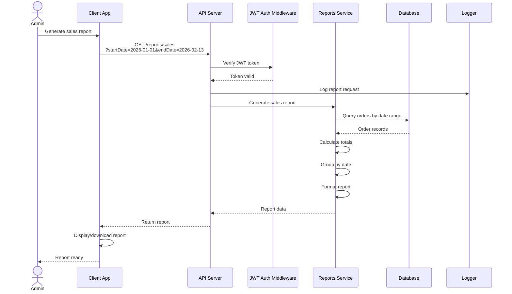
```mermaid
sequenceDiagram
    actor Admin
    participant Client as Client App
    participant API as API Server
    participant Auth as JWT Auth Middleware
    participant Reports as Reports Service
    participant DB as Database
    participant Logger as Logger

    Admin->>Client: Generate sales report
    Client->>API: GET /reports/sales<br/>?startDate=2026-01-01&endDate=2026-02-13
    API->>Auth: Verify JWT token
    Auth-->>API: Token valid
    API->>Logger: Log report request
    API->>Reports: Generate sales report
    Reports->>DB: Query orders by date range
    DB-->>Reports: Order records
    Reports->>Reports: Calculate totals
    Reports->>Reports: Group by date
    Reports->>Reports: Format report
    Reports-->>API: Report data
    API-->>Client: Return report
    Client->>Client: Display/download report
    Client-->>Admin: Report ready
```

---

## 9. Token Validation & Request Processing Sequence

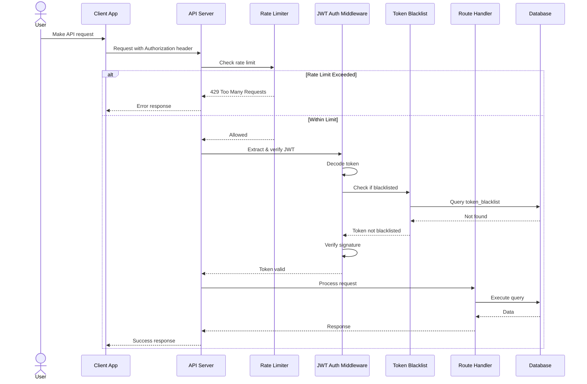
```mermaid
sequenceDiagram
    actor User
    participant Client as Client App
    participant API as API Server
    participant RateLimit as Rate Limiter
    participant Auth as JWT Auth Middleware
    participant Blacklist as Token Blacklist
    participant Handler as Route Handler
    participant DB as Database

    User->>Client: Make API request
    Client->>API: Request with Authorization header
    API->>RateLimit: Check rate limit
    alt Rate Limit Exceeded
        RateLimit-->>API: 429 Too Many Requests
        API-->>Client: Error response
    else Within Limit
        RateLimit-->>API: Allowed
        API->>Auth: Extract & verify JWT
        Auth->>Auth: Decode token
        Auth->>Blacklist: Check if blacklisted
        Blacklist->>DB: Query token_blacklist
        DB-->>Blacklist: Not found
        Blacklist-->>Auth: Token not blacklisted
        Auth->>Auth: Verify signature
        Auth-->>API: Token valid
        API->>Handler: Process request
        Handler->>DB: Execute query
        DB-->>Handler: Data
        Handler-->>API: Response
        API-->>Client: Success response
    end
```

---

## 10. Error Handling Sequence

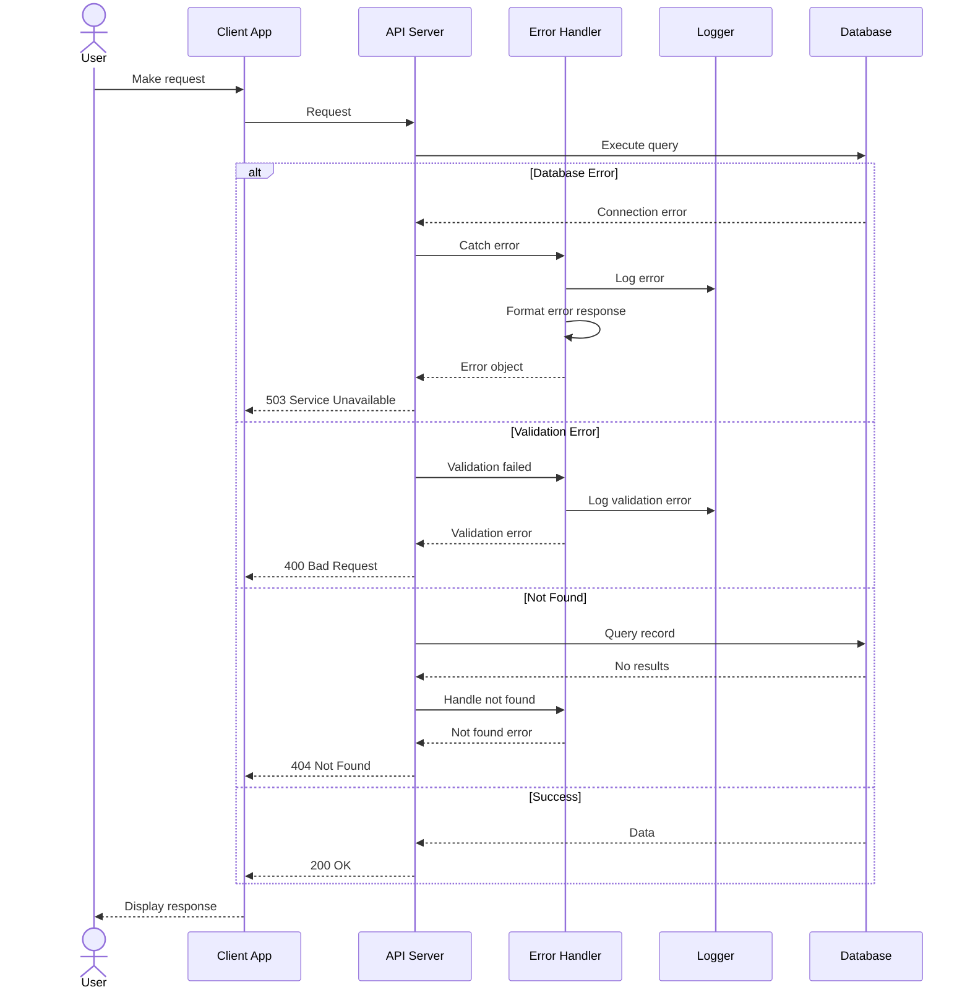
```mermaid
sequenceDiagram
    actor User
    participant Client as Client App
    participant API as API Server
    participant Handler as Error Handler
    participant Logger as Logger
    participant DB as Database

    User->>Client: Make request
    Client->>API: Request
    API->>DB: Execute query
    alt Database Error
        DB-->>API: Connection error
        API->>Handler: Catch error
        Handler->>Logger: Log error
        Handler->>Handler: Format error response
        Handler-->>API: Error object
        API-->>Client: 503 Service Unavailable
    else Validation Error
        API->>Handler: Validation failed
        Handler->>Logger: Log validation error
        Handler-->>API: Validation error
        API-->>Client: 400 Bad Request
    else Not Found
        API->>DB: Query record
        DB-->>API: No results
        API->>Handler: Handle not found
        Handler-->>API: Not found error
        API-->>Client: 404 Not Found
    else Success
        DB-->>API: Data
        API-->>Client: 200 OK
    end
    Client-->>User: Display response
```

---

## 11. Complete Order Lifecycle Sequence

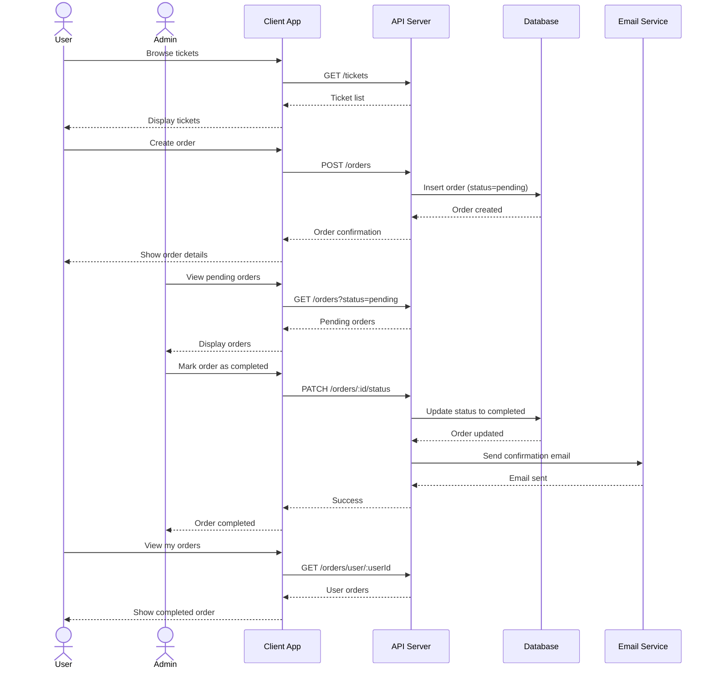
```mermaid
sequenceDiagram
    actor User
    actor Admin
    participant Client as Client App
    participant API as API Server
    participant DB as Database
    participant Email as Email Service

    User->>Client: Browse tickets
    Client->>API: GET /tickets
    API-->>Client: Ticket list
    Client-->>User: Display tickets

    User->>Client: Create order
    Client->>API: POST /orders
    API->>DB: Insert order (status=pending)
    DB-->>API: Order created
    API-->>Client: Order confirmation
    Client-->>User: Show order details

    Admin->>Client: View pending orders
    Client->>API: GET /orders?status=pending
    API-->>Client: Pending orders
    Client-->>Admin: Display orders

    Admin->>Client: Mark order as completed
    Client->>API: PATCH /orders/:id/status
    API->>DB: Update status to completed
    DB-->>API: Order updated
    API->>Email: Send confirmation email
    Email-->>API: Email sent
    API-->>Client: Success
    Client-->>Admin: Order completed

    User->>Client: View my orders
    Client->>API: GET /orders/user/:userId
    API-->>Client: User orders
    Client-->>User: Show completed order
```

---

## 12. Concurrent Requests Handling Sequence

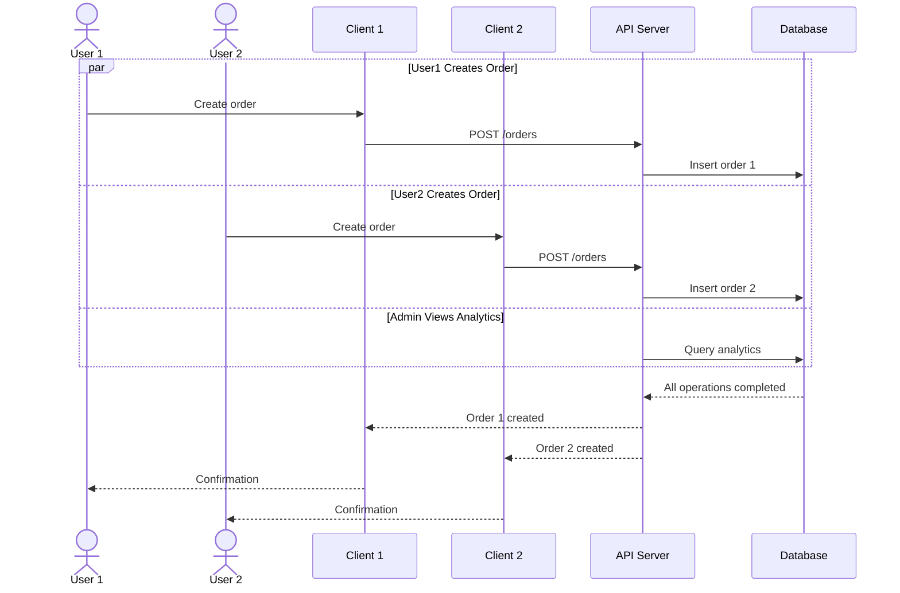
```mermaid
sequenceDiagram
    actor User1 as User 1
    actor User2 as User 2
    participant Client1 as Client 1
    participant Client2 as Client 2
    participant API as API Server
    participant DB as Database

    par User1 Creates Order
        User1->>Client1: Create order
        Client1->>API: POST /orders
        API->>DB: Insert order 1
    and User2 Creates Order
        User2->>Client2: Create order
        Client2->>API: POST /orders
        API->>DB: Insert order 2
    and Admin Views Analytics
        API->>DB: Query analytics
    end

    DB-->>API: All operations completed
    API-->>Client1: Order 1 created
    API-->>Client2: Order 2 created
    Client1-->>User1: Confirmation
    Client2-->>User2: Confirmation
```

---

## 13. Data Validation Flow Sequence

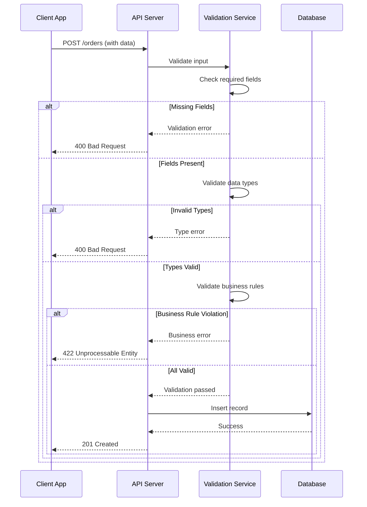
```mermaid
sequenceDiagram
    participant Client as Client App
    participant API as API Server
    participant Validation as Validation Service
    participant DB as Database

    Client->>API: POST /orders (with data)
    API->>Validation: Validate input
    
    Validation->>Validation: Check required fields
    alt Missing Fields
        Validation-->>API: Validation error
        API-->>Client: 400 Bad Request
    else Fields Present
        Validation->>Validation: Validate data types
        alt Invalid Types
            Validation-->>API: Type error
            API-->>Client: 400 Bad Request
        else Types Valid
            Validation->>Validation: Validate business rules
            alt Business Rule Violation
                Validation-->>API: Business error
                API-->>Client: 422 Unprocessable Entity
            else All Valid
                Validation-->>API: Validation passed
                API->>DB: Insert record
                DB-->>API: Success
                API-->>Client: 201 Created
            end
        end
    end
```

---

## 14. Authentication Flow with Refresh Token Sequence

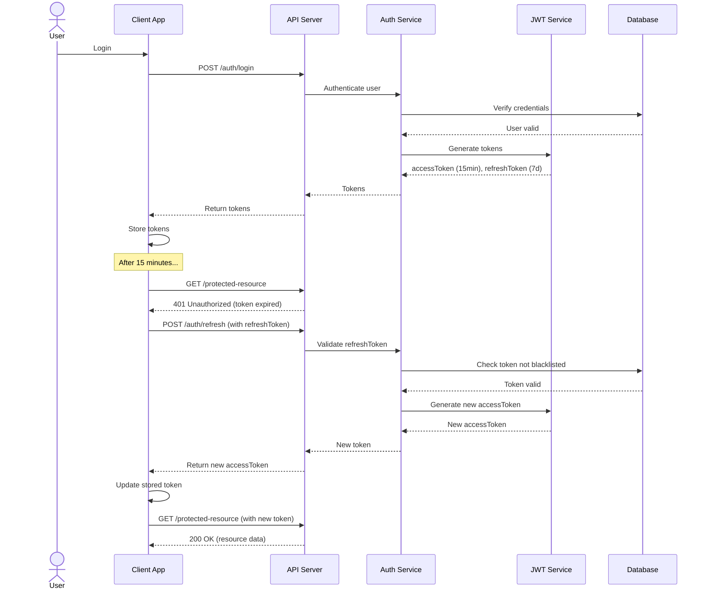
```mermaid
sequenceDiagram
    actor User
    participant Client as Client App
    participant API as API Server
    participant Auth as Auth Service
    participant JWT as JWT Service
    participant DB as Database

    User->>Client: Login
    Client->>API: POST /auth/login
    API->>Auth: Authenticate user
    Auth->>DB: Verify credentials
    DB-->>Auth: User valid
    Auth->>JWT: Generate tokens
    JWT-->>Auth: accessToken (15min), refreshToken (7d)
    Auth-->>API: Tokens
    API-->>Client: Return tokens
    Client->>Client: Store tokens

    Note over Client: After 15 minutes...
    Client->>API: GET /protected-resource
    API-->>Client: 401 Unauthorized (token expired)

    Client->>API: POST /auth/refresh (with refreshToken)
    API->>Auth: Validate refreshToken
    Auth->>DB: Check token not blacklisted
    DB-->>Auth: Token valid
    Auth->>JWT: Generate new accessToken
    JWT-->>Auth: New accessToken
    Auth-->>API: New token
    API-->>Client: Return new accessToken
    Client->>Client: Update stored token

    Client->>API: GET /protected-resource (with new token)
    API-->>Client: 200 OK (resource data)
```

---

## 15. Multi-Step Order Processing Sequence

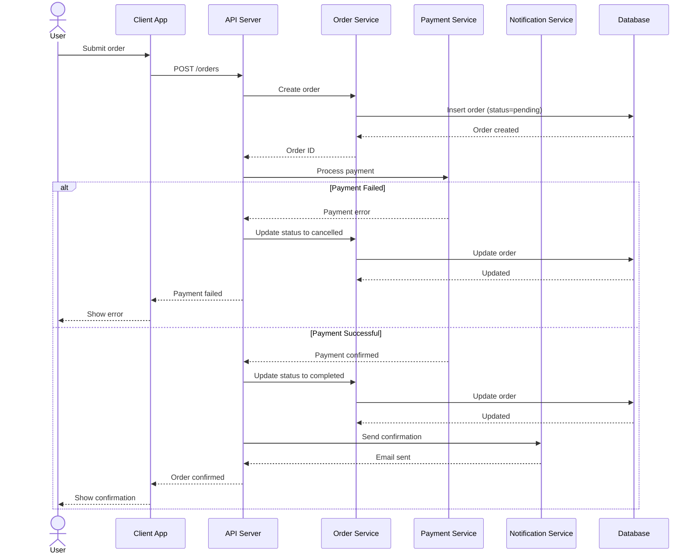
```mermaid
sequenceDiagram
    actor User
    participant Client as Client App
    participant API as API Server
    participant Order as Order Service
    participant Payment as Payment Service
    participant Notification as Notification Service
    participant DB as Database

    User->>Client: Submit order
    Client->>API: POST /orders
    API->>Order: Create order
    Order->>DB: Insert order (status=pending)
    DB-->>Order: Order created
    Order-->>API: Order ID

    API->>Payment: Process payment
    alt Payment Failed
        Payment-->>API: Payment error
        API->>Order: Update status to cancelled
        Order->>DB: Update order
        DB-->>Order: Updated
        API-->>Client: Payment failed
        Client-->>User: Show error
    else Payment Successful
        Payment-->>API: Payment confirmed
        API->>Order: Update status to completed
        Order->>DB: Update order
        DB-->>Order: Updated
        API->>Notification: Send confirmation
        Notification-->>API: Email sent
        API-->>Client: Order confirmed
        Client-->>User: Show confirmation
    end
```

---

## Key Sequence Patterns

### Authentication Pattern
1. Client sends credentials
2. Server validates against database
3. Server generates JWT tokens
4. Client stores tokens locally
5. Client includes token in subsequent requests

### Authorization Pattern
1. Client sends request with token
2. Server extracts token from header
3. Server verifies token signature
4. Server checks token expiration
5. Server checks token blacklist
6. Server extracts user info from token
7. Server processes request

### Error Handling Pattern
1. Request received
2. Validation performed
3. If error: format error response, log error, return error status
4. If success: process request, return success response

### Data Modification Pattern
1. Receive request with data
2. Validate data
3. Check authorization
4. Query existing record
5. Update record
6. Return updated record

### Reporting Pattern
1. Receive report request with filters
2. Query database with filters
3. Aggregate data
4. Format report
5. Return formatted report

