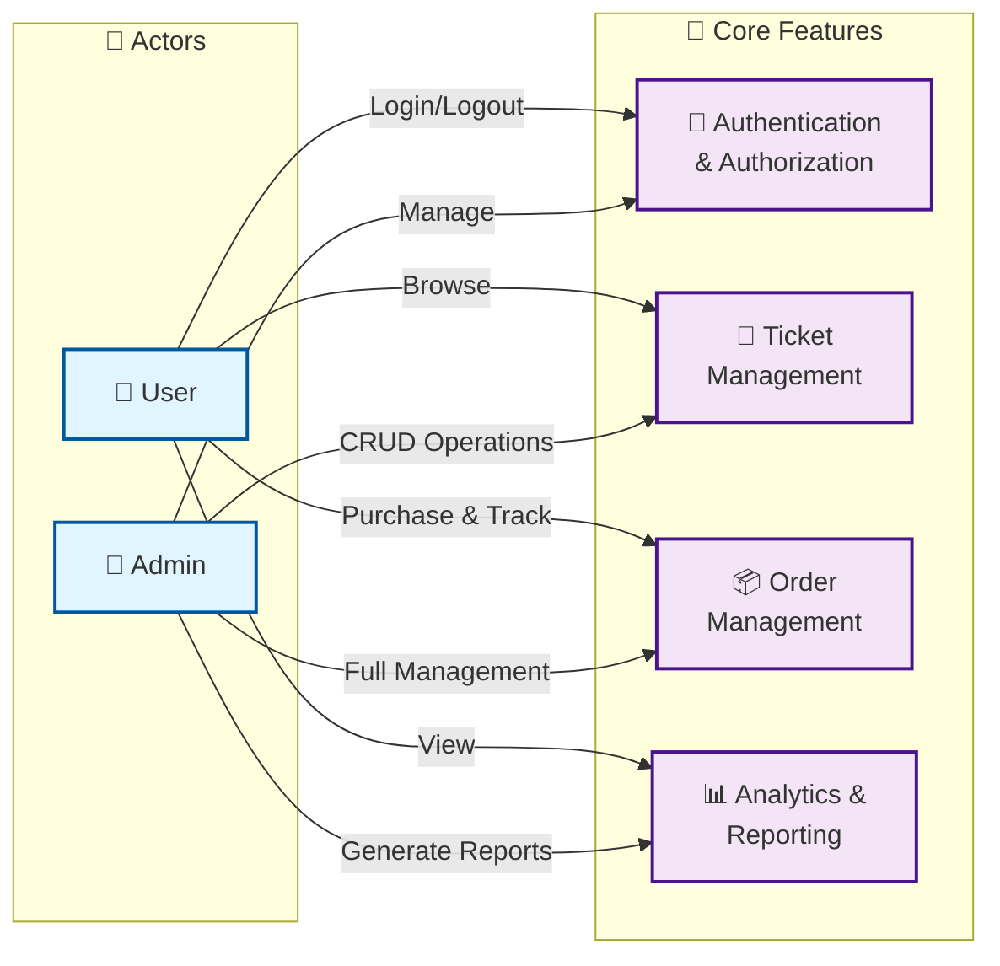

# Ticketing Mock API - Use Case Diagram

## Mermaid Use Case Diagram (Flowchart LR)

```mermaid
flowchart LR
    subgraph Actors["👥 Actors"]
        User["👤 User"]
        Admin["👤 Admin"]
        System["🔧 System"]
    end

    subgraph Auth["🔐 Authentication"]
        Login["Login"]
        Logout["Logout"]
        RefreshToken["Refresh Token"]
        ViewProfile["View Profile"]
    end

    subgraph Tickets["🎫 Ticket Management"]
        ViewTickets["View Tickets"]
        CreateTicket["Create Ticket"]
        UpdateTicket["Update Ticket"]
        DeleteTicket["Delete Ticket"]
        ViewTicketStats["View Ticket Stats"]
    end

    subgraph Orders["📦 Order Management"]
        ViewOrders["View Orders"]
        CreateOrder["Create Order"]
        UpdateOrderStatus["Update Order Status"]
        ViewUserOrders["View User Orders"]
        ViewOrderStats["View Order Stats"]
    end

    subgraph Analytics["📊 Analytics"]
        ViewDashboard["View Dashboard"]
        ViewTicketAnalytics["View Ticket Analytics"]
        ViewOrderAnalytics["View Order Analytics"]
        ViewRevenueAnalytics["View Revenue Analytics"]
        ViewTicketTypeDistribution["View Ticket Type Distribution"]
        ViewStatusDistribution["View Status Distribution"]
    end

    subgraph Reports["📋 Reports"]
        GenerateTicketReport["Generate Ticket Report"]
        GenerateOrderReport["Generate Order Report"]
        GenerateSalesReport["Generate Sales Report"]
        GenerateUserActivityReport["Generate User Activity Report"]
        GenerateSummaryReport["Generate Summary Report"]
    end

    subgraph System_Mgmt["⚙️ System Management"]
        HealthCheck["Health Check"]
        RateLimiting["Rate Limiting"]
        ErrorHandling["Error Handling"]
        RequestLogging["Request Logging"]
    end

    %% User interactions
    User -->|Authenticate| Login
    User -->|End Session| Logout
    User -->|Extend Session| RefreshToken
    User -->|Check Info| ViewProfile
    User -->|Browse| ViewTickets
    User -->|Purchase| CreateOrder
    User -->|Track| ViewUserOrders
    User -->|Update| UpdateOrderStatus
    User -->|Monitor| ViewDashboard
    User -->|Analyze| ViewOrderAnalytics
    User -->|Review| GenerateOrderReport

    %% Admin interactions
    Admin -->|Authenticate| Login
    Admin -->|End Session| Logout
    Admin -->|Extend Session| RefreshToken
    Admin -->|Check Info| ViewProfile
    Admin -->|Browse| ViewTickets
    Admin -->|Add| CreateTicket
    Admin -->|Modify| UpdateTicket
    Admin -->|Remove| DeleteTicket
    Admin -->|Monitor| ViewTicketStats
    Admin -->|Manage| ViewOrders
    Admin -->|Create| CreateOrder
    Admin -->|Update| UpdateOrderStatus
    Admin -->|Monitor| ViewDashboard
    Admin -->|Analyze| ViewTicketAnalytics
    Admin -->|Analyze| ViewOrderAnalytics
    Admin -->|Analyze| ViewRevenueAnalytics
    Admin -->|Analyze| ViewTicketTypeDistribution
    Admin -->|Analyze| ViewStatusDistribution
    Admin -->|Generate| GenerateTicketReport
    Admin -->|Generate| GenerateOrderReport
    Admin -->|Generate| GenerateSalesReport
    Admin -->|Generate| GenerateUserActivityReport
    Admin -->|Generate| GenerateSummaryReport

    %% System interactions
    System -->|Monitor| HealthCheck
    System -->|Enforce| RateLimiting
    System -->|Handle| ErrorHandling
    System -->|Track| RequestLogging

    %% Styling
    classDef actor fill:#e1f5ff,stroke:#01579b,stroke-width:2px
    classDef usecase fill:#f3e5f5,stroke:#4a148c,stroke-width:2px
    classDef system fill:#e8f5e9,stroke:#1b5e20,stroke-width:2px

    class User,Admin,System actor
    class Login,Logout,RefreshToken,ViewProfile,ViewTickets,CreateTicket,UpdateTicket,DeleteTicket,ViewTicketStats,ViewOrders,CreateOrder,UpdateOrderStatus,ViewUserOrders,ViewOrderStats,ViewDashboard,ViewTicketAnalytics,ViewOrderAnalytics,ViewRevenueAnalytics,ViewTicketTypeDistribution,ViewStatusDistribution,GenerateTicketReport,GenerateOrderReport,GenerateSalesReport,GenerateUserActivityReport,GenerateSummaryReport usecase
    class HealthCheck,RateLimiting,ErrorHandling,RequestLogging system
```



## Alternative: Simplified Use Case Diagram (Flowchart LR)



## Detailed Use Case Descriptions

### Authentication Use Cases
- **Login**: User/Admin authenticates with email and password, receives access and refresh tokens
- **Logout**: User/Admin ends session, token is blacklisted
- **Refresh Token**: User/Admin extends session by refreshing access token
- **View Profile**: User/Admin views their account information

### Ticket Management Use Cases
- **View Tickets**: Browse available ticket types with pagination and filters
- **Create Ticket**: Admin creates new ticket type with code and price
- **Update Ticket**: Admin modifies ticket price or visibility status
- **Delete Ticket**: Admin soft-deletes ticket (hides from catalog)
- **View Ticket Stats**: View ticket statistics (total, visible, hidden)

### Order Management Use Cases
- **View Orders**: Admin views all orders with filters and pagination
- **Create Order**: User/Admin creates new ticket order with visitor details
- **Update Order Status**: Change order status (pending → completed → cancelled)
- **View User Orders**: User views their own orders
- **View Order Stats**: View order statistics (total, by status, by type, revenue)

### Analytics Use Cases
- **View Dashboard**: Combined view of tickets and orders statistics
- **View Ticket Analytics**: Detailed ticket statistics
- **View Order Analytics**: Detailed order statistics
- **View Revenue Analytics**: Revenue breakdown by payment type
- **View Ticket Type Distribution**: Orders distribution by ticket type
- **View Status Distribution**: Orders distribution by status

### Reports Use Cases
- **Generate Ticket Report**: Detailed report with filters (status, price range)
- **Generate Order Report**: Detailed report with filters (status, type, payment type)
- **Generate Sales Report**: Sales by date range
- **Generate User Activity Report**: User activity and spending patterns
- **Generate Summary Report**: Complete overview of all data

### System Use Cases
- **Health Check**: Monitor API health and database connectivity
- **Rate Limiting**: Enforce request rate limits per IP
- **Error Handling**: Standardized error responses
- **Request Logging**: Log all requests for debugging and monitoring

## Key Relationships

### Authentication Required
- All Ticket Management operations (except View Tickets)
- All Order Management operations
- All Analytics operations
- All Reports operations

### Public Access
- View Tickets (no auth required)
- Health Check (no auth required)
- Login (no auth required)

### Role-Based Access
- **Admin**: Full access to all operations
- **User**: Limited to own orders and read-only analytics

## Data Flow

```
User/Admin
    ↓
Authentication (Login/Logout/Refresh)
    ↓
Authorization Check (Role-based)
    ↓
Request Processing
    ├─ Ticket Management
    ├─ Order Management
    ├─ Analytics
    └─ Reports
    ↓
Response Formatting
    ↓
Client
```

## API Endpoints Mapping

| Use Case | HTTP Method | Endpoint | Auth Required |
|----------|-------------|----------|---------------|
| Login | POST | /auth/login | No |
| Logout | POST | /auth/logout | Yes |
| Refresh Token | POST | /auth/refresh | No |
| View Profile | GET | /auth/me | Yes |
| View Tickets | GET | /tickets | No |
| Create Ticket | POST | /tickets | Yes (Admin) |
| Update Ticket | PUT | /tickets/:id | Yes (Admin) |
| Delete Ticket | DELETE | /tickets/:id | Yes (Admin) |
| View Ticket Stats | GET | /tickets/stats/summary | No |
| View Orders | GET | /orders | Yes |
| Create Order | POST | /orders | Yes |
| Update Order Status | PATCH | /orders/:id/status | Yes |
| View User Orders | GET | /orders/user/:userId | Yes |
| View Order Stats | GET | /orders/stats/summary | Yes |
| View Dashboard | GET | /analytics/dashboard | Yes |
| View Ticket Analytics | GET | /analytics/tickets | Yes |
| View Order Analytics | GET | /analytics/orders | Yes |
| View Revenue Analytics | GET | /analytics/revenue | Yes |
| View Ticket Type Distribution | GET | /analytics/ticket-types | Yes |
| View Status Distribution | GET | /analytics/ticket-status | Yes |
| Generate Ticket Report | GET | /reports/tickets | Yes |
| Generate Order Report | GET | /reports/orders | Yes |
| Generate Sales Report | GET | /reports/sales | Yes |
| Generate User Activity Report | GET | /reports/user-activity | Yes |
| Generate Summary Report | GET | /reports/summary | Yes |
| Health Check | GET | /health | No |
